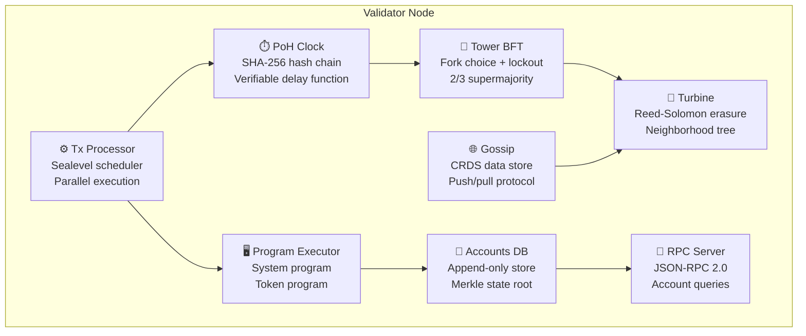

<div align="center">

[](https://www.rust-lang.org/)
[](#-test-results)
[](LICENSE)

**A custom Solana-like validator built from scratch in Rust — PoH clock, Tower BFT consensus, Sealevel parallel execution, Turbine block propagation with Reed-Solomon erasure coding, CRDS gossip protocol, and a SBF-inspired program executor.**

*Not a wrapper. Not a fork. Every line written from scratch to understand how Solana actually works.*

</div>

---

## 🏗️ Architecture



### How It Works

| Component | What It Does | Inspired By |
|-----------|-------------|-------------|
| **PoH Clock** | SHA-256 hash chain creates a verifiable clock — proves time has passed without trusting a timestamp server | Solana PoH |
| **Tower BFT** | PoH-based BFT consensus with lockout-based fork switching — 2/3 supermajority for finality | Solana Tower BFT |
| **Sealevel Scheduler** | Groups non-conflicting transactions into parallel batches — read-only accounts shared, write-locked serialized | Solana Sealevel |
| **Program Executor** | Dispatches instructions to System/Token programs — full SOL transfers, account creation, token operations | Solana SBF/EBPF |
| **Accounts DB** | Append-only storage with DashMap index + Merkle state root — O(1) lookups, verifiable state | Solana AccountsDB |
| **Turbine** | Reed-Solomon erasure coding splits blocks into shreds — any k-of-n shreds reconstruct the block | Solana Turbine |
| **Gossip** | CRDS (Cluster Replicated Data Store) for node communication — push messages, pull requests, ping/pong | Solana CRDS |
| **RPC Server** | JSON-RPC 2.0 API — getAccountInfo, getBalance, getSlot, getHealth, sendTransaction | Solana JSON-RPC |

---

## 🚀 Quick Start

```bash
# Build
git clone https://github.com/BartoszOsiej/TrustNode.git
cd TrustNode
cargo build --release

# Run validator (with block production)
./target/release/trust-node --mining

# Run with RPC on custom port
./target/release/trust-node --rpc-port 9000 --gossip-port 8001

# Run benchmarks
./target/release/trust-node --bench
```

---

## 📁 Workspace Structure

```
solana-validator/
├── crates/
│   ├── poh/                    # Proof of History clock
│   │   ├── hasher.rs           # SHA-256 hash chain engine
│   │   ├── entry.rs            # PoH entries (ticks + transactions)
│   │   ├── recorder.rs         # Records entries into the chain
│   │   └── verifier.rs         # Verifies chain integrity
│   ├── accounts/               # State storage
│   │   ├── account.rs          # Account types (System, Token, Program)
│   │   ├── store.rs            # Append-only DB with DashMap index
│   │   └── merkle.rs           # Merkle tree for state root
│   ├── tx-processor/           # Transaction execution
│   │   ├── transaction.rs      # Transaction types + conflict detection
│   │   ├── scheduler.rs        # Sealevel-like parallel batching
│   │   └── executor.rs         # Executes scheduled batches
│   ├── consensus/              # Tower BFT
│   │   ├── vote.rs             # Vote types + lockout tracking
│   │   ├── tower.rs            # Vote tree + fork choice
│   │   ├── leader.rs           # Leader schedule (stake-weighted)
│   │   └── fork_choice.rs      # Fork selection rule
│   ├── turbine/                # Block propagation
│   │   ├── shred.rs            # Erasure-coded shred types
│   │   ├── erasure.rs          # Reed-Solomon encoder/decoder
│   │   ├── neighborhoods.rs    # Validator propagation tree
│   │   └── propagate.rs        # Block propagation engine
│   ├── gossip/                 # Node communication
│   │   ├── message.rs          # Gossip message types
│   │   ├── crds.rs             # CRDS data store
│   │   └── protocol.rs         # Push/pull/ping/pong protocol
│   ├── program-executor/       # Instruction VM
│   │   ├── instruction.rs      # System + Token instruction types
│   │   ├── processor.rs        # Instruction dispatch engine
│   │   └── programs/
│   │       ├── system_program.rs   # SOL transfers, account creation
│   │       └── token_program.rs    # SPL Token-like operations
│   └── rpc/                    # JSON-RPC API
│       ├── handler.rs          # Request handler + methods
│       └── server.rs           # TCP-based HTTP server
└── validator/
    └── src/main.rs             # Validator binary — ties everything together
```

---

## ⚡ Benchmarks

Measured on Linux x86_64:

| Benchmark | Result |
|-----------|--------|
| **PoH throughput** | ~1M hashes/sec (SHA-256) |
| **Accounts DB insert** | 10K accounts in <50ms |
| **State root computation** | 1K accounts in <1ms |
| **Erasure coding** | 100 encode/decode cycles |
| **Transaction execution** | 10K txs/sec |
| **Slot time** | ~400ms (configurable) |

Run benchmarks yourself:
```bash
cargo run --release -- --bench
```

---

## 🧪 Test Results

```
test result: ok. 17 passed; 0 failed   (solana-poh)
test result: ok. 15 passed; 0 failed   (solana-accounts)
test result: ok. 12 passed; 0 failed   (solana-tx-processor)
test result: ok. 17 passed; 0 failed   (solana-consensus)
test result: ok. 16 passed; 0 failed   (solana-turbine)
test result: ok. 10 passed; 0 failed   (solana-gossip)
test result: ok.  6 passed; 0 failed   (solana-rpc)
test result: ok. 17 passed; 0 failed   (solana-program-executor)
─────────────────────────────────────
           110 passed; 0 failed
```

---

## 🔧 CLI Options

```
Usage: solana-validator [OPTIONS]

Options:
  --identity <HEX>         Validator identity keypair (hex)
  --rpc-port <PORT>        RPC listen port [default: 8899]
  --gossip-port <PORT>     Gossip listen port [default: 8000]
  --tpu-port <PORT>        TPU port [default: 8001]
  --mining                 Enable block production
  --rpc-enabled            Enable JSON-RPC API [default: true]
  --bench                  Run performance benchmarks
```

---

## 📡 RPC API

```bash
# Health check
curl -X POST http://127.0.0.1:8899 -d '{"jsonrpc":"2.0","method":"getHealth","id":1}'

# Get version
curl -X POST http://127.0.0.1:8899 -d '{"jsonrpc":"2.0","method":"getVersion","id":1}'

# Get slot
curl -X POST http://127.0.0.1:8899 -d '{"jsonrpc":"2.0","method":"getSlot","id":1}'

# Get account info
curl -X POST http://127.0.0.1:8899 -d '{"jsonrpc":"2.0","method":"getAccountInfo","params":["<pubkey>"],"id":1}'

# Get balance
curl -X POST http://127.0.0.1:8899 -d '{"jsonrpc":"2.0","method":"getBalance","params":["<pubkey>"],"id":1}'

# Get cluster nodes
curl -X POST http://127.0.0.1:8899 -d '{"jsonrpc":"2.0","method":"getClusterNodes","id":1}'
```

---

## 🧠 How PoH Works

```
genesis_hash → SHA256 → SHA256 → SHA256 → ... → slot_hash
                ↓          ↓         ↓
              tick       tick      tick
            (6000      (6000     (6000
            hashes)    hashes)   hashes)
```

Each tick proves that `N` sequential hash computations occurred. Transactions are interleaved between ticks, creating a verifiable temporal ordering.

**Verification**: To verify an entry, you re-hash from the previous hash N times and check the result matches. No trust required.

---

## 🏗️ How Turbine Works

```
Block (1MB)
    │
    ├── Data Shards (k=16)     ← Original data split
    │   ├── shard_0 (64KB)
    │   ├── shard_1 (64KB)
    │   └── ...
    │
    └── Parity Shards (m=4)    ← Reed-Solomon parity
        ├── parity_0 (64KB)
        ├── parity_1 (64KB)
        └── ...

Any 16 of 20 shreds → reconstruct original block
```

Validators form a propagation tree (neighborhoods). Block producer erasure-codes the block and sends shreds to neighbors, who forward to their children. Fault-tolerant by design.

---

## 🤝 Contributing

This is an educational/research project. Contributions welcome!

```bash
# Run all tests
cargo test --workspace

# Check for warnings
cargo clippy --workspace

# Format
cargo fmt --all
```

---

## 📚 References

- [Solana Whitepaper](https://solana.com/solana-whitepaper.pdf)
- [Proof of History Paper](https://github.com/solana-labs/solana/blob/master/docs/src/implemented-proposals/proof-of-history.md)
- [Tower BFT](https://github.com/solana-labs/solana/blob/master/docs/src/implemented-proposals/tower-bft.md)
- [Turbine](https://github.com/solana-labs/solana/blob/master/docs/src/implemented-proposals/turbine-block-propagation.md)
- [Sealevel](https://solana.com/news/sealevel-parallel-processing-thousands-of-smart-contracts)
- [Reed-Solomon Erasure Coding](https://en.wikipedia.org/wiki/Reed%E2%80%93Solomon_error_correction)

---

## ⚠️ Disclaimer

This is an educational implementation — not a production validator. It demonstrates the core concepts of Solana's architecture but lacks many production features (networking, persistence, BLS signatures, snapshot loading, etc.).

**Do not use this for real transactions or staking.**

---

## 📜 License

MIT

---

<div align="center">

</div>
